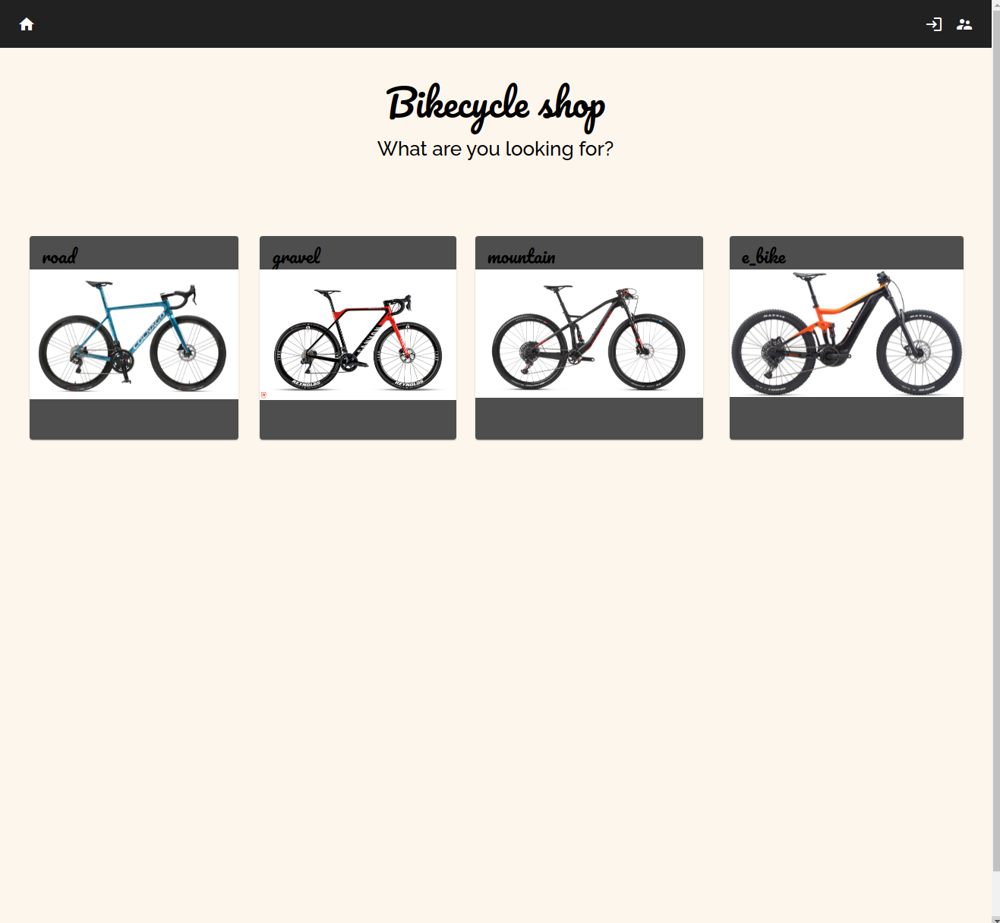
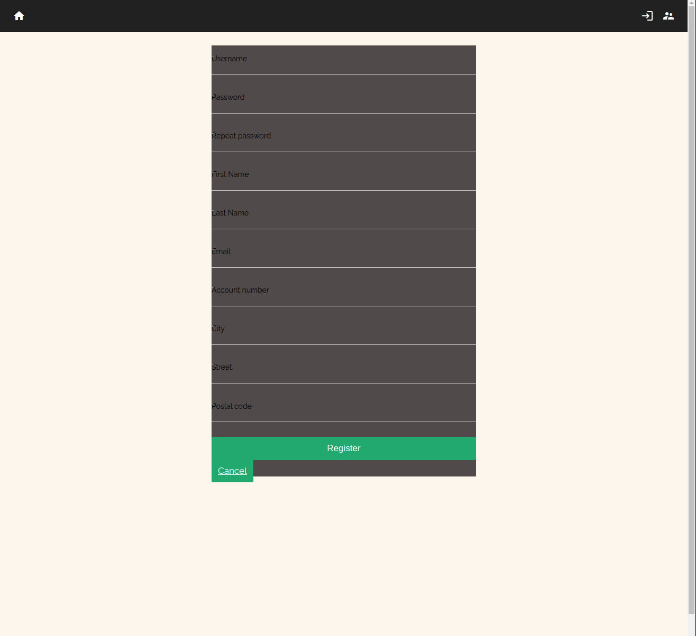
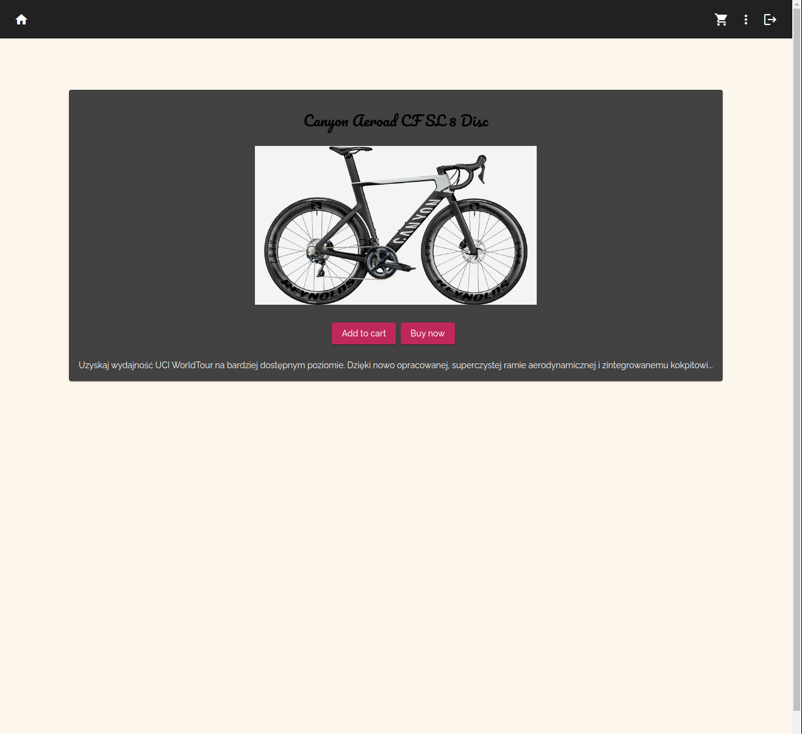
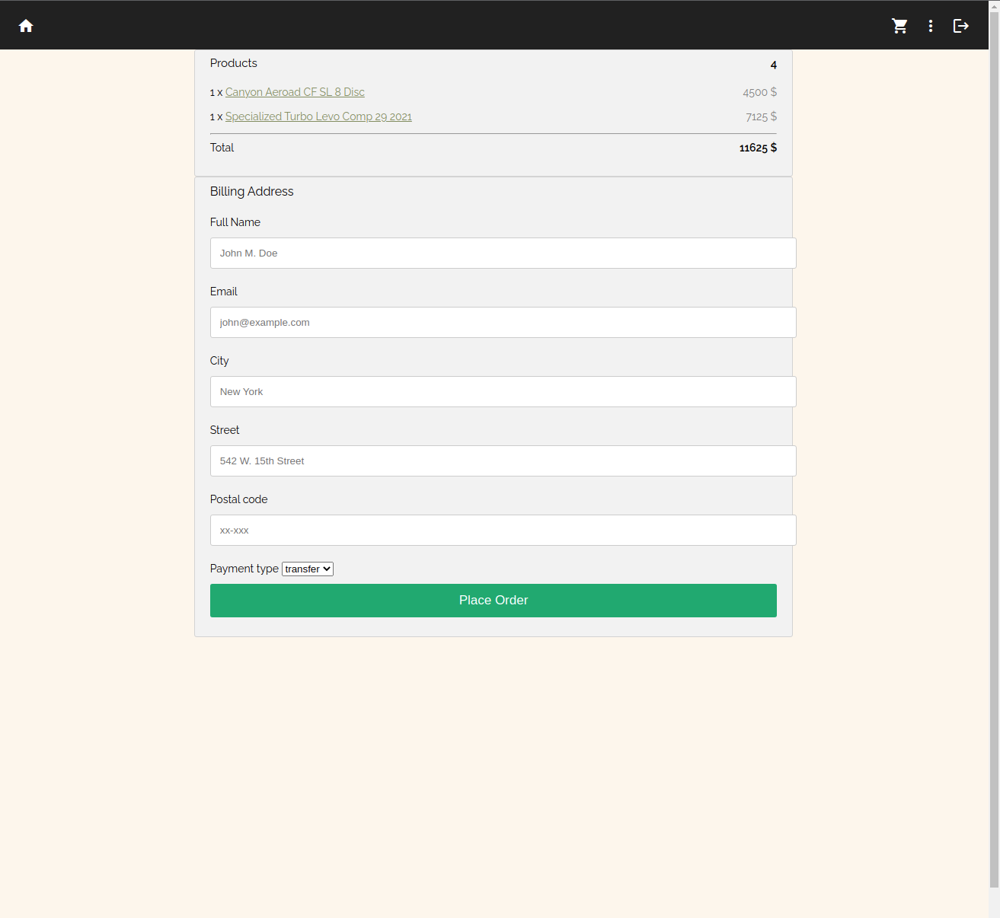
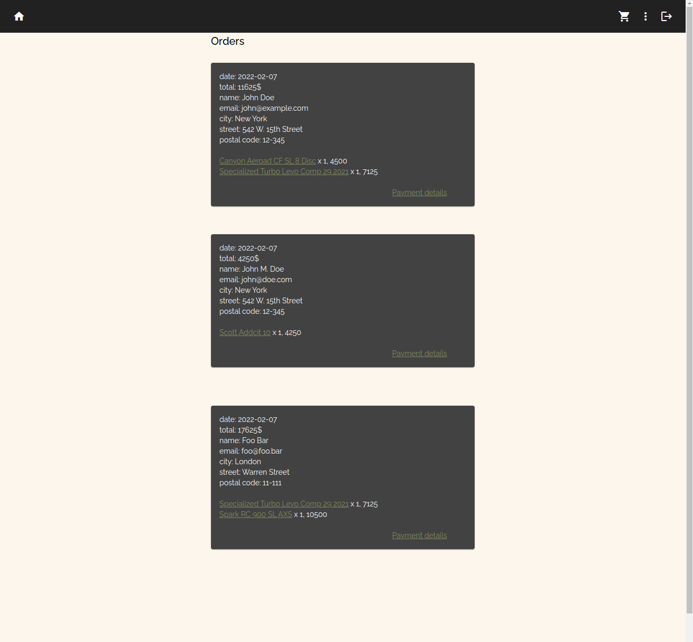
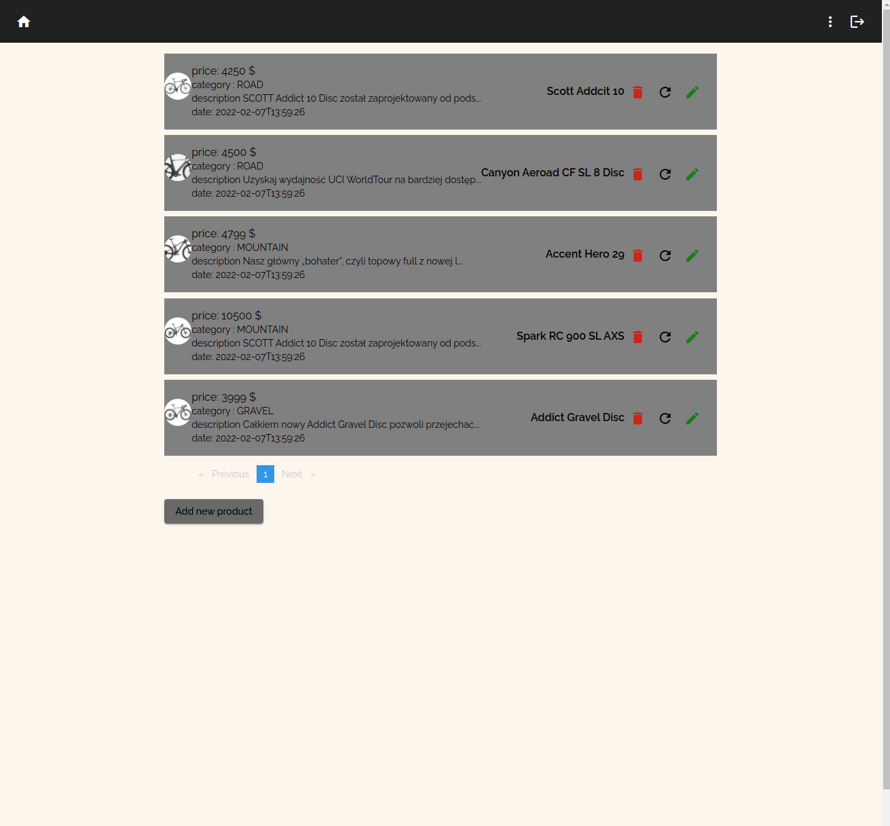

<div id="top"></div>

[](https://angular.io/cli)
<a href="https://www.linkedin.com/in/fryderyk-jachimczak/">

</a> 


<br />
<div align="center">
    
    <h3 align="center">eshop-frontend-angular</h3>
  <p align="center">
    User interface for online bike shop
    <br />
    <a href="https://github.com/JFrred/bike-shop-angular"><strong>Explore the docs »</strong></a>
    <br />
    <br />
    <a href="https://github.com/JFrred/bike-shop-spring">View backend code</a>
</div>


<!-- TABLE OF CONTENTS -->
<details>
  <summary>Table of Contents</summary>

  <ol>
    <li>
      <a href="#about-the-project">About The Project</a>
      <ul>
        <li><a href="#built-with">Built With</a></li>
      </ul>
    </li>
    <li>
      <a href="#demo">Demo</a>
      <ul>
      <li><a href="#home-page">Home page</a></li>
      <li><a href="#register-page">Register page</a></li>
      <li><a href="#product-page">Product page</a></li>
      <li><a href="#cart-page">Cart page</a></li>
      <li><a href="#order-form-page">Order form page</a></li>
      <li><a href="#orders-list-page">Orders list page</a></li>
      <li><a href="#admin-page">Admin page</a></li>
      </ul>
    </li>
    <li>
      <a href="#quick-started">Quick start</a>
      <ul>
        <li><a href="#development-server">Development server</a></li>
        <li><a href="#code-scaffolding">Code scaffolding</a></li>
        <li><a href="#build">Build</a></li>
        <li><a href="#further-help">Help</a></li>
      </ul>
    </li>
  </ol>
</details>

## About the project
This project was generated with [Angular CLI](https://github.com/angular/angular-cli) version 13.0.4.
It is simple user interface which is 
## Built With
* [AngularCli](https://angular.io/cli)


## Demo
### Home page
<br>

### Register page
<br>

### Product page
<br>

### Cart page
<br>

### Order form page
<br>

### Orders list page
<br>

### Admin page
<br>


## Quick start
```sh
git clone https://github.com/JFrred/bike-shop-angular.git
```

### Development server

Run `ng serve` for a dev server. Navigate to `http://localhost:4200/`. The app will automatically reload if you change any of the source files.

### Code scaffolding

Run ng generate component component-name `to generate a new component. You can also use` ng generate directive|pipe|service|class|guard|interface|enum|module`.

### Build

Run `ng build` to build the project. The build artifacts will be stored in the `dist/` directory.

### Running unit tests

Run `ng test` to execute the unit tests via [Karma](https://karma-runner.github.io).

### Running end-to-end tests

Run `ng e2e` to execute the end-to-end tests via a platform of your choice. To use this command, you need to first add a package that implements end-to-end testing capabilities.

### Further help

To get more help on the Angular CLI use `ng help` or go check out the [Angular CLI Overview and Command Reference](https://angular.io/cli) page.


<!-- https://www.markdownguide.org/basic-syntax/#reference-style-links -->
[contributors-shield]: https://img.shields.io/github/contributors/othneildrew/Best-README-Template.svg?style=for-the-badge
[contributors-url]: https://github.com/othneildrew/Best-README-Template/graphs/contributors
[forks-shield]: https://img.shields.io/github/forks/othneildrew/Best-README-Template.svg?style=for-the-badge
[forks-url]: https://github.com/othneildrew/Best-README-Template/network/members
[stars-shield]: https://img.shields.io/github/stars/othneildrew/Best-README-Template.svg?style=for-the-badge
[stars-url]: https://github.com/othneildrew/Best-README-Template/stargazers
[issues-shield]: https://img.shields.io/github/issues/othneildrew/Best-README-Template.svg?style=for-the-badge
[issues-url]: https://github.com/othneildrew/Best-README-Template/issues
[license-shield]: https://img.shields.io/github/license/othneildrew/Best-README-Template.svg?style=for-the-badge
[license-url]: https://github.com/othneildrew/Best-README-Template/blob/master/LICENSE.txt
[linkedin-shield]: https://img.shields.io/badge/-LinkedIn-black.svg?style=for-the-badge&logo=linkedin&colorB=555
[linkedin-url]: https://linkedin.com/in/othneildrew
[product-screenshot]: images/screenshot.png
